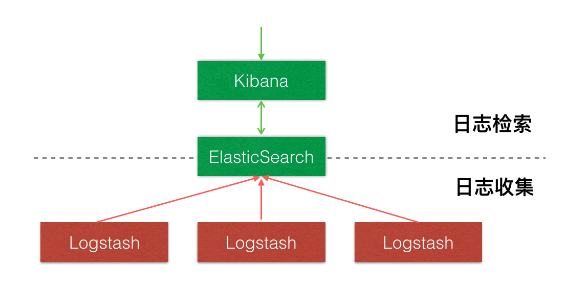
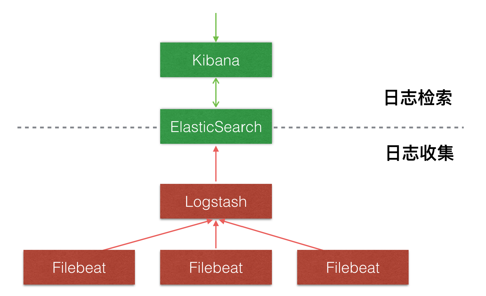
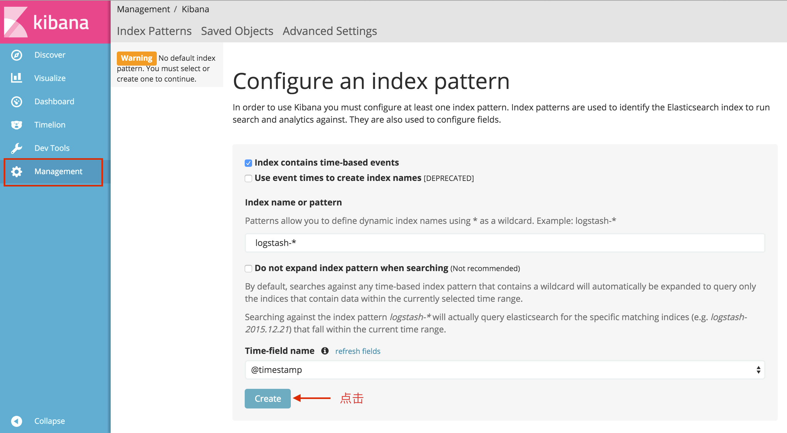
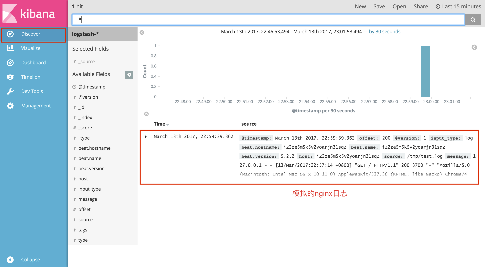

# 基于ELK+Filebeat搭建日志中心
> 摘要：本文属于原创，欢迎转载，转载请保留出处：[https://github.com/jasonGeng88/blog](https://github.com/jasonGeng88/blog)
 
> 本文是基于docker进行的容器化搭建ELK 
 
## 当前环境
1. 系统：centos7
2. docker 1.12.1


## 介绍

### ElasticSearch

Elasticsearch 是一个实时的分布式搜索和分析引擎，它可以用于全文搜索，结构化搜索以及分析。它是一个建立在全文搜索引擎 Apache Lucene 基础上的搜索引擎，使用 Java 语言编写。

### Logstash
Logstash 是一个具有实时渠道能力的数据收集引擎，主要用于日志的收集与解析，并将其存入
ElasticSearch中。

### Kibana
Kibana 是一款基于 Apache 开源协议，使用 JavaScript 语言编写，为 Elasticsearch 提供分析和可视化的 Web 平台。它可以在 Elasticsearch 的索引中查找，交互数据，并生成各种维度的表图。

### Filebeat
引入Filebeat作为日志搜集器，主要是为了解决Logstash开销大的问题。相比Logstash，Filebeat 所占系统的 CPU 和内存几乎可以忽略不计。

## 架构
### 不引入Filebeat


### 引入Filebeat



## 部署

### 启动ElasticSearch 
```
docker run -d -p 9200:9200 --name elasticsearch elasticsearch 

```
### 启动Logstash 

```
# 1. 新建配置文件logstash.conf
input {
    beats {
        port => 5044
    }
}

output {
    stdout {
        codec => rubydebug
    }
    elasticsearch {
        #填写实际情况elasticsearch的访问IP，因为是跨容器间的访问，使用内网、公网IP，不要填写127.0.0.1|localhost
        hosts => ["{$ELASTIC_IP}:9200"] 
        
    }
}

# 2.启动容器，暴露并映射端口，挂载配置文件
docker run -d --expose 5044 -p 5044:5044 --name logstash -v "$PWD":/config-dir logstash -f /config-dir/logstash.conf
```


### 启动Filebeat
下载地址：[https://www.elastic.co/downloads/beats/filebeat](https://www.elastic.co/downloads/beats/filebeat)


```
# 1.下载Filebeat压缩包
wget https://artifacts.elastic.co/downloads/beats/filebeat/filebeat-5.2.2-linux-x86_64.tar.gz

# 2.解压文件
tar -xvf filebeat-5.2.2-linux-x86_64.tar.gz

# 3.新建配置文件filebeat.yml
filebeat:
  prospectors:
    - paths:
        - /tmp/test.log #日志文件地址
      input_type: log #从文件中读取
      tail_files: true #以文件末尾开始读取数据
output:
  logstash:
      hosts: ["{$LOGSTASH_IP}:5044"] #填写logstash的访问IP
      
# 4.运行filebeat  
./filebeat-5.2.2-linux-x86_64/filebeat -e -c filebeat.yml
```


### 启动Kibana
```
docker run -d --name kibana -e ELASTICSEARCH_URL=http://{$ELASTIC_IP}:9200 -p 5601:5601 kibana
```


## 测试
1. 模拟日志数据

```
# 1.创建日志文件
touch /tmp/test.log

# 2.向日志文件中写入一条nginx访问日志
echo '127.0.0.1 - - [13/Mar/2017:22:57:14 +0800] "GET / HTTP/1.1" 200 3700 "-" "Mozilla/5.0 (Macintosh; Intel Mac OS X 10_11_0) AppleWebKit/537.36 (KHTML, like Gecko) Chrome/46.0.2490.86 Safari/537.36" "-"' >> /tmp/test.log
```

2. 访问 http://{$KIBANA_IP}:5601



## 总结
本文主要讲述了如何一步步搭建ELK的过程，以及Filebeat在其中所起的作用。<br>
这儿仅仅给大家做了一个演示，要在生产环境中部署时，还需使用数据卷进行数据持久化，容器内存问题也需考虑，elasticsearch与logstash都是相对吃内存的，如果不加以限制，很可能会拖垮你整个服务器。<br>当然安全因素也是大家不能忽视的，如传输的安全性、端口权限的最小化暴露程度，防火墙设置等。

## 后续
1. logstash解析日志格式，如JAVA、nginx、nodejs等日志；
2. elasticsearch的常用搜索语法；
2. 通过kibana制作可视化图表；


