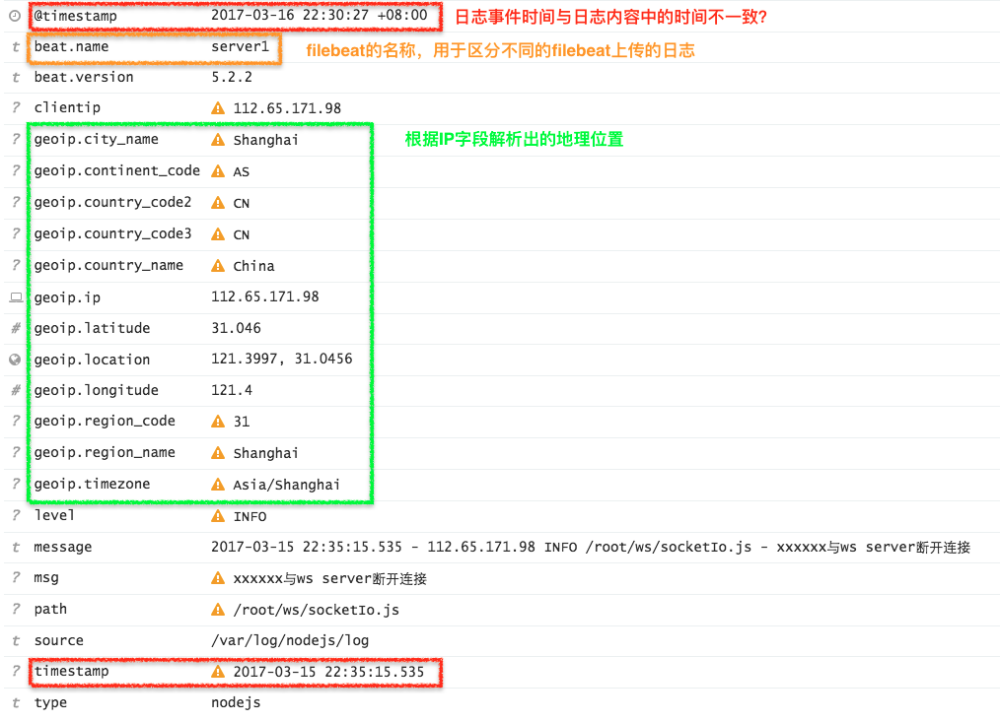
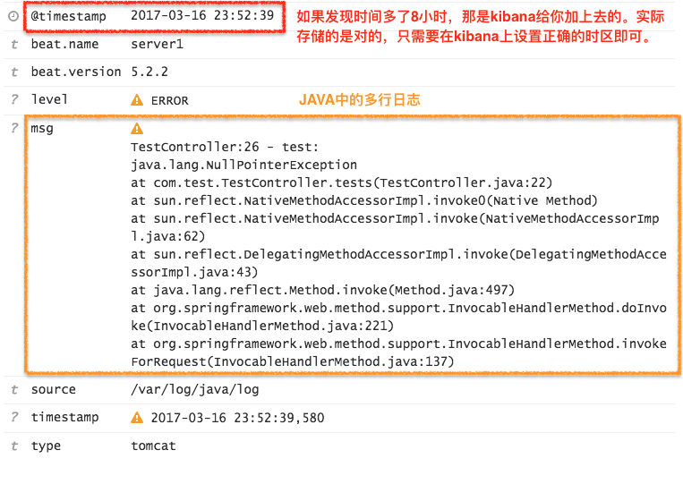

# ELK实战之解析各类日志文件
 
> ELK环境是基于docker进行的容器化部署 <br>
> 关于容器化部署，详情见上一篇 [“ELK：基于ELK+Filebeat的日志搭建”](https://github.com/jasonGeng88/blog/blob/master/201703/elk.md)
 
## 当前环境
1. logstash：5.2


## 介绍
基于上一篇讲述了ELK日志系统的搭建，那么就该讲讲ELK在生产中的实际使用场景了。<br>

作为一个日志中心，肯定不单单只收集一种日志，那每种不同的日志，它的存储格式势必有所差异，但同时又存在一些共性的东西（如日志级别，记录时间等）。我们如何去解析不同类型的日志、提炼共性的字段，这就是我写本篇文章的主旨。

## 原理
依照前文，使用filebeat作为日志上传，logstash进行日志处理，elasticsearch作为日志存储与搜索，最后使用kibana作为日志的可视化呈现。所以不难发现，日志解析主要还是logstash做的事情。<br>

说到logstash，它到底有哪些东西呢？我们来简单看下：


从上图中可以看到，logstash主要包含三大模块：

1. INPUTS: 收集所有数据源的日志数据（[源有file、redis、beats等](https://www.elastic.co/guide/en/logstash/current/input-plugins.html),*filebeat就是使用了beats源*）；
2. FILTERS: 解析、整理日志数据（**本文重点**）；
3. OUTPUTS: 将解析的日志数据输出至存储器（[elasticseach、file、syslog等](https://www.elastic.co/guide/en/logstash/current/output-plugins.html)）；


下面来讲讲filter中的常用几个插件（*后面日志解析会用到*）：

1. grok：采用正则的方式，解析原始日志格式，使其结构化；
2. geoip：根据IP字段，解析出对应的地理位置、经纬度等；
3. date：解析选定时间字段，将其时间作为logstash每条记录产生的时间（*若没有指定该字段，默认使用read line的时间作为该条记录时间*）；

*注意：codec也是经常会使用到的，它主要作用在INPUTS和OUTPUTS中，[提供有json的格式转换、multiline的多行日志合并等](https://www.elastic.co/guide/en/logstash/current/codec-plugins.html)*

## 场景
说了这么说，到底怎么用呢？下面我通过几个例子，向大家讲讲日志解析具体是怎么做的。
我们先易后难，通过几个例子，希望能帮助大家彻底解决日志解析问题。

**1. NodeJS 日志**

* 日志格式

``` 
$time - $remote_addr $log_level $path - $msg 
```

* 日志内容

```
2017-03-15 18:34:14.535 - 112.65.171.98 INFO /root/ws/socketIo.js - xxxxxx与ws server断开连接
```

* filebeat配置（*建议filebeat使用rpm安装，以systemctl start filebeat方式启动*）

```
filebeat:
  prospectors:
    - document_type: nodejs #申明type字段为nodejs，默认为log
      paths:
        - /var/log/nodejs/log #日志文件地址
      input_type: log #从文件中读取
      tail_files: true #以文件末尾开始读取数据
output:
  logstash:
      hosts: ["${LOGSTASH_IP}:5044"]

#General Setting
name: "server1" #设置beat的名称，默认为主机hostname
```

* logstash中FILTERS配置

```
filter {
	if [type] == "nodejs" { #根据filebeat中设置的type字段，来过滤不同的解析规则
    	grok{
       		match => { "message" => "%{TIMESTAMP_ISO8601:timestamp} - %{IPORHOST:clientip} %{LOGLEVEL:level} %{PATH:path} - %{GREEDYDATA:msg}" }
	    }
    	geoip {
       		source => "clientip" #填写IP字段
    	}
    }
}
```

* 结果（*为方便演示，数据有删减*）


* **Filter配置讲解**

	1. grok中的match内容：
		1. 	key：表示所需解析的内容；
		2. value：表示匹配解析规则，生成对应字段；
		3. 解析规则：%{正则模板:自定义字段}，其中TIMESTAMP_ISO8601、IPORHOST等都是grok提供的正则模板（[可在此查阅](https://github.com/logstash-plugins/logstash-patterns-core/blob/master/patterns/grok-patterns)）；
	2. geoip：是分析IP值，生成IP对应的地理位置信息；

	*这里是否发现@timestamp与timestamp不一致，@timestamp表示该日志的读取时间，在elasticsearch中作为时间查找索引。下面讲解Nginx日志时，会去修正这一问题。*
	
****
	
**2. Nginx 访问日志**

* 日志格式
 
``` 
$remote_addr - $remote_user [$time_local] 
"$request" $status $body_bytes_sent "$http_referer" 
"$http_user_agent" "$http_x_forwarded_for"
```

* 日志内容

```
112.65.171.98 - - [15/Mar/2017:18:18:06 +0800] "GET /index.html HTTP/1.1" 200 1150 "http://www.yourdomain.com/" "Mozilla/5.0 (Macintosh; Intel Mac OS X 10_11_6) AppleWebKit/537.36 (KHTML, like Gecko) Chrome/50.0.2661.102 Safari/537.36" "-"
```

* filebeat中prospectors的配置

```
- document_type: nginx
  paths:
    - /var/log/nginx/access.log #日志文件地址
  input_type: log #从文件中读取
  tail_files: true #以文件末尾开始读取数据
```

* logstash中FILTERS配置

```
filter {
	if [type] == "nginx" {
		grok{
	       match => { "message" => "%{COMBINEDAPACHELOG}" }
	    }
	
	   date {
	        match => [ "timestamp" , "dd/MMM/yyyy:HH:mm:ss Z", "ISO8601" ]
	        target => "@timestamp" #可省略
	    }
	}
    
}
```

* 结果


* **Filter配置讲解**
	1. grok：
		1. 是不是很不可思议，上一示例中我们匹配规则写了一长串，这个仅仅一个COMBINEDAPACHELOG就搞定了！
		2. grok除了提供上面那种基础的正则规则，还对常用的日志（java,http,syslog等）提供的相应解析模板，[详情见grok的120中正则模板](https://github.com/logstash-plugins/logstash-patterns-core/tree/master/patterns)；
	2. date:
		1. match：数组中第一个值为要匹配的时间字段，后面的n个是匹配规则，它们的关系是or的关系，满足一个即可；
		2. target：将match中匹配的时间替换该字段，默认替换@timestamp；

	*目前为止我们解析的都是单行的日志，向JAVA这样的，若果是多行的日志我们又该怎么做呢？*
	
****

**3. JAVA Log4j 日志**

* 日志内容

```
'2017-03-16 15:52:39,580 ERROR TestController:26 - test:
java.lang.NullPointerException
	at com.test.TestController.tests(TestController.java:22)
	at sun.reflect.NativeMethodAccessorImpl.invoke0(Native Method)
	at sun.reflect.NativeMethodAccessorImpl.invoke(NativeMethodAccessorImpl.java:62)
	at sun.reflect.DelegatingMethodAccessorImpl.invoke(DelegatingMethodAccessorImpl.java:43)
	at java.lang.reflect.Method.invoke(Method.java:497)
	at org.springframework.web.method.support.InvocableHandlerMethod.doInvoke(InvocableHandlerMethod.java:221)
	at org.springframework.web.method.support.InvocableHandlerMethod.invokeForRequest(InvocableHandlerMethod.java:137)'

```

* filebeat中prospectors的配置

```
- document_type: tomcat
  paths:
    - /var/log/java/log #日志文件地址
  input_type: log #从文件中读取
  tail_files: true #以文件末尾开始读取数据
  multiline:
    pattern: ^\d{4}
    match: after
    negate: true
```

* logstash中FILTERS配置

```
filter {
	if [type] == "tomcat" {
		grok{
			match => { "message" => "%{TIMESTAMP_ISO8601:timestamp} %{LOGLEVEL:level} %{JAVALOGMESSAGE:msg}" }
		}
		
		date {
	   		match => [ "timestamp" , "yyyy-MM-dd HH:mm:ss,S", "ISO8601" ]
		}
	}
    
}I
```

* 结果



* **Filebeat配置讲解**
	1. multiline 合并多行日志：
		1. pattern：匹配规则，这里指匹配每条日志开始的年份；
		2. match：有before与after，这里指从该行开始向后匹配；
		3. negate：是否开始一个新记录，这里指当pattern匹配后，结束之前的记录，创建一条新日志记录；

		*当然在logstash input中使用codec multiline设置是一样的*
		
*小技巧：关于grok的正则匹配，官方有给出[Grok Constructor](http://grokconstructor.appspot.com/)方法，在这上面提供了debugger、自动匹配等工具，方便大家编写匹配规则*


## 总结
本文开始简单介绍了logstash的三大模块：INPUTS、FILTERS、OUTPUTS。之后通过3个示例的介绍，给大家讲解了FILTERS中grok、geoip、date三个常用插件的使用，以及在处理多行日志上的做法。<br>

在描述的过程中可能不能面面俱到，但秉承的原则是“<font color=red>知其然知其所以然</font>”。如果真遇到解析某类日志的话，相信在网上搜一下，有一大堆案例，但是否都能理解呢？<br>

最后，有兴趣可以去看一下它的官方手册，对这三大模块，各自都提供了非常多的插件支持。我这里只是一个简单的使用，希望对大家有所帮助。

## 后续
1. kibana可视化视图的使用；
2. elk的分布式扩展；

