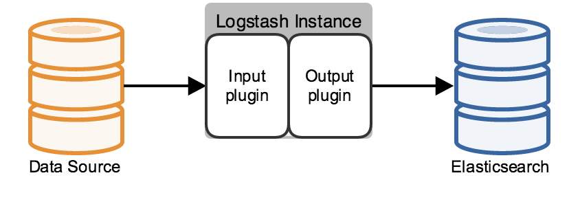

# 【译】Logstash的部署与扩展
 
> 摘要：本文属于原创，未经允许不得转载！
 
## 原文链接

[https://www.elastic.co/guide/en/logstash/current/deploying-and-scaling.html#deploying-and-scaling](https://www.elastic.co/guide/en/logstash/current/deploying-and-scaling.html#deploying-and-scaling)

## 最简安装
Logstash的最简安装是一个Logstash实例、一个Elasticsearch实例。两者之间是直接相连的。按照Logstash的处理流程，使用了一个采集数据的INPUT插件，一个在Elasticsearch上索引数据的OUTPUT插件。Logstash实例按照配置文件上的固定流程来启动。你必须指明一个INPUT插件，OUTPUT默认输出方式是stdout，FILTER是可选的，下文会讲到。

## 引入 Filters
日志数据一般都是无结构化的，经常包含与你使用使用场景无关的信息，或者丢失一些能够从日志内容中获取的相关信息。你可以使用[filter plugin](https://www.elastic.co/guide/en/logstash/5.2/filter-plugins.html)来解析你的日志，移除无用的信息，生成有效字段，并可以通已有字段中提取更多的额外信息。例如，filters可以从IP地址中获取地理信息，将其添加进日志中，或者使用[grok filter](https://www.elastic.co/guide/en/logstash/5.2/plugins-filters-grok.html)解析文本信息，使其结构化。 

添加filter plugin最明显的是会影响性能，这取决于filter plugin执行的计算开销，以及处理的日志大小。grok filter的正则计算尤其占用资源。处理计算资源消耗大的一种方式是采用计算机的多核进行并行计算。使用 -w 参数来设置Logstash filter任务的执行线程数。例如，bin/logstash -w 8 命令使用的是8个不同的线程来处理filter。

## 引入Filebeat
[Filebeat](https://www.elastic.co/guide/en/beats/filebeat/current/index.html) 是一款有Go语言编写的轻量级、资源消耗低的日志收集工具，主要作用是收集服务器上的日志，并将其传输到其他机器上进行处理。Filebeat 使用[Beats](https://www.elastic.co/guide/en/beats/libbeat/current/index.html)协议与一个Logstash实例进行通信。使用[Beats input plugin](https://www.elastic.co/guide/en/logstash/5.2/plugins-inputs-beats.html)来配置你的Logstash的实例，让其接收Beats传来的数据。 

Filebeat使用的是源数据所在机器的计算资源，Beats input plugin 最小化了Logstash实例的资源需求，这种架构对于有资源限制要求的场景来说，非常有用。

## 扩展到更大的Elasticsearch集群

