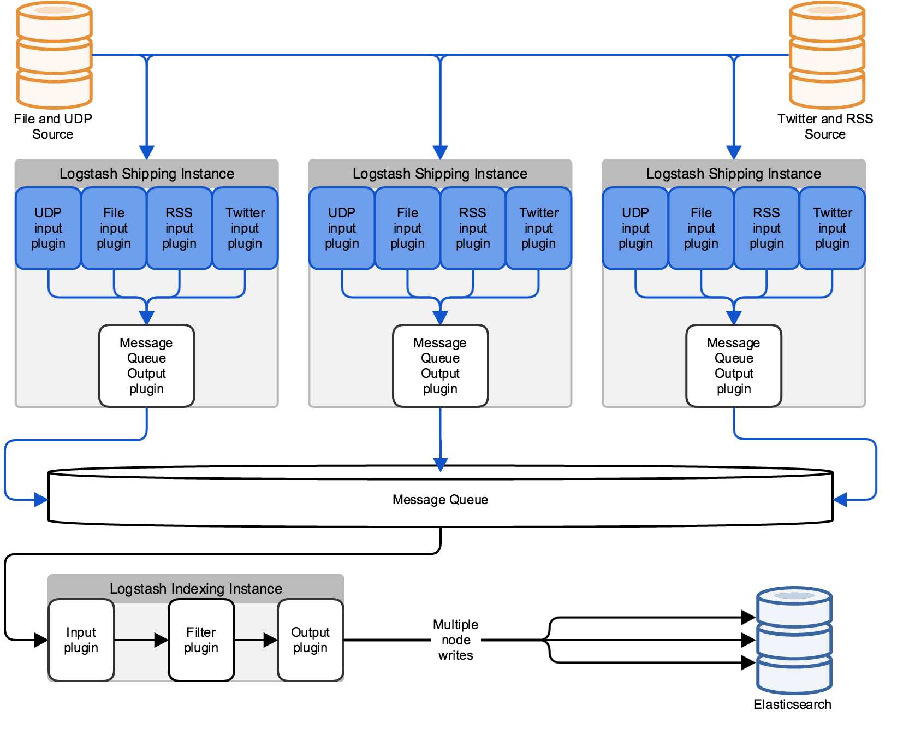

# [译] ELK日志中心分布式架构的逐步演化
 
> 摘要：本文属于原创，欢迎转载，转载请保留出处：[https://github.com/jasonGeng88/blog](https://github.com/jasonGeng88/blog)

## 当前环境
1. logstash：5.2

## 说明
记得写 [“基于ELK+Filebeat搭建日志中心”](https://github.com/jasonGeng88/blog/blob/master/201703/elk.md) 时，有朋友跟我说：“你的日志中心缺少了消息队列。” 是的，没有考虑。因为暂时用不到，架构的演变一定是根据业务的发展逐步完成的。我觉得任何东西，太少或太过都未必是好事。构架能满足公司当前的发展，那就是好的。

当然我不是指架构可以随意设计，只要满足需求就好。我们设计的架构，满足现有需求当然是先决条件，但还得看得到可预见的未来，为架构的演进预留一定的扩展性。

所以架构既得满足公司业务，还要参考一些成熟的方案，不能生搬硬套。这也是我也这篇文章的原因，自知能力有限，要讲分布式我肯定讲不好，其中势必有很多坑。所以借鉴官网原文，给目前或今后要做分布式的同学一点建议（当然也包括我~）。

***这里我不会对原文逐字翻译，会根据自己的理解，以我自己能看懂的表述来翻译给大家看。***

## 原文链接

[https://www.elastic.co/guide/en/logstash/current/deploying-and-scaling.html#deploying-and-scaling](https://www.elastic.co/guide/en/logstash/current/deploying-and-scaling.html#deploying-and-scaling)

# 译文 

## 概述
当Logstash的使用场景逐步演进时，我们之前的架构也将随之发生改变。本文讨论了在复杂度逐渐递增下的Logstash架构一系列的演变过程。我们先从一个最简单的架构开始，然后在此架构上来逐渐增加内容。本文的示例是将数据写入到了ES（*Elasticsearch*）集群，其实Logstash可以写的[输出源](https://www.elastic.co/guide/en/logstash/5.2/output-plugins.html)非常多。

## 最简架构
Logstash最简单的架构可以由一个Logstash实例和一个ES实例组成，两者直接相连。按照Logstash的[处理流程](https://www.elastic.co/guide/en/logstash/5.2/pipeline.html)，我们使用了一个收集数据的[INPUT插件](https://www.elastic.co/guide/en/logstash/5.2/input-plugins.html)和一个数据写入ES的[OUTPUT插件](https://www.elastic.co/guide/en/logstash/5.2/output-plugins.html)，最后按照实例配置文件上的固定配置，启动Logstash。配置文件中，INPUT插件与OUTPUT插件是必须的，且OUTPUT默认输出方式是stdout，FILTER是可选的，下文会讲到。

## 引入 Filters
日志数据默认是无结构化的，经常包含一些无用信息，有时也会丢失一些本可从日志中获取的相关信息。你可以使用[FILTER插件](https://www.elastic.co/guide/en/logstash/5.2/filter-plugins.html)来解析你的日志，从中提取有效字段，剔除无用的信息，还可以从有效字段中衍生出额外信息。例如，filters可以从IP地址中衍生出地理信息，将其添加进日志中，也可以使用[grok filter](https://www.elastic.co/guide/en/logstash/5.2/plugins-filters-grok.html)解析文本信息，使其结构化。

当然，添加FILTER插件对性能是有一定影响的。这取决于FILTER插件执行的计算量，以及处理的日志大小。grok filter的正则计算尤其占用资源。解决资源消耗大的一种方式是利用计算机多核的特性进行并行计算。使用 -w 参数来设置 Logstash filter 任务的执行线程数。例如，bin/logstash -w 8 命令使用的是8个不同的线程来处理filter。

## 引入 Filebeat
[Filebeat](https://www.elastic.co/guide/en/beats/filebeat/current/index.html) 是一款有Go语言编写的轻量级日志收集工具，主要作用是收集当前服务器上的日志，并将收集的数据输出到目标机器上进行进一步处理。Filebeat 使用 [Beats](https://www.elastic.co/guide/en/beats/libbeat/current/index.html) 协议与Logstash实例进行通信。使用 [Beats input 插件](https://www.elastic.co/guide/en/logstash/5.2/plugins-inputs-beats.html) 来配置你的Logstash的实例，让其能够接收Beats传来的数据。

Filebeat使用的是源数据所在机器的计算资源，Beats input 插件最小化了Logstash实例的资源需求，这种架构对于有资源限制要求的场景来说，非常有用。

## 引入ES集群

Logstash 一般不与ES的单节点进行通信，而是和多个节点组成的ES集群进行通信，采用的协议默认是HTTP。

你可以使用ES提供的REST API接口向集群写入数据，传输的数据格式为JSON。使用REST接口在代码中不需要引入JAVA的客户端类或任何额外的JAR包。相比节点协议与传输格式，没有性能上的弊端。若要做到接口安全通信，可以使用 [X-Pack Security](https://www.elastic.co/guide/en/x-pack/current/xpack-security.html) ，它支持SSL与HTTP basic的安全校验。

当你使用HTTP协议时，可以在Logstash的 ES output 插件配置中，提供ES集群的多个请求地址，ES的请求将自动做到负载均衡。多个ES节点通过路由流量到活跃节点的方式也为ES集群提供的高可用性。

你也可以使用ES的 JAVA API将数据序列化为二进制后，再进行传输。该协议可以嗅探请求的地址，你可以选择集群中任意的客户端或节点进行通信。

使用HTTP，可以将ES集群与Logstash实例相分离。 与此相反，节点协议把运行Logstash实例的机器作为一个运行中的ES节点，与ES集群连接在了一起。数据同步是将数据从一个节点传输至集群中的其余节点。当该机器作为集群的一部分，该段网络拓扑变得可用，对于使用相对少量持久连接的场景来说，使用节点协议是较合适的。

你也可以使用第三方的负载均衡硬件或软件，来处理Logstash与外部应用的连接。

*注意：确保你的Logstash配置不直接连接到ES[管理集群的主节点](https://www.elastic.co/guide/en/elasticsearch/reference/5.2/modules-node.html)上。将Logstash连接到客户端或数据节点上，来保护ES集群的稳定性。*

## 使用消息队列处理吞吐量峰值

当Logstash接收数据的能力超过了ES集群处理数据的能力时，你可以使用消息队列来作为缓冲。默认情况下，当数据的处理速率低于接收速率，Logstash的接收将产生瓶颈。由于该瓶颈会导致事件在数据源中被缓冲，所以使用消息队列来抗压将成为你架构中的重要环节。

添加一个消息队列到你部署的Logstash中，对数据丢失也提供了一定的保护。当Logstash实例在消息队列中消费数据失败时，数据将会在另一个活跃的Logstash中重新消费。

目前市面上提供的第三方消息队列，如Redis，Kafka，RabbitMQ。Logstash都提供了相应的input、output插件与之做集成。当Logstash的部署中添加了消息队列，Logstash的处理将分为两个阶段：第一阶段（传输实例），负责处理数据采集，并将其存入消息队列；第二阶段（存储实例），从消息队列中获取数据，应用所配置的filter，将处理过的数据写入ES中。

## 采用多连接保证Logstash高可用

为了使Logstash架构更适应单节点不可用的情况，，你可以在数据源与Logstash集群间建立负载均衡。这个负载均衡管理与Logstash实例的连接，保证了在单个实例不可用的情况下，数据采集与处理的正常进行。

上面的架构中存在一种问题，每个Logstash实例都只提供一种INPUT。当某一个实例不可用时，该类型的数据将无法继续收集，例如RSS订阅或文件输入。为了使INPUT的处理更健壮，每个Logstash实例都要配置多个input通道，如下图：

该架构基于你配置的INPUT，可以并行工作。对于更多的INPUT输入，你可以增加更多的Logstash实例来进行水平扩展。这也增加了架构的可靠性，消除了单点故障。

## Logstash的扩展

一个成熟的Logstash部署有以下几方面：

* INPUT层从数据源中采集数据，由合适的input 插件组成。
* 消息队列作为数据采集的缓冲与故障转移的保护。
* FILTER层从消息队列中获取数据进行解析和其他操作。
* indexing层将处理的数据传输到ES。

这其中的每一层都可以通过增加计算资源进行扩展。随着你使用场景的发展与所需资源的增加，定期检查这些组件的性能。当Logstash一旦遇到输入的瓶颈，可考虑增加消息队列的存储。相反，通过增加更多的Logstash输出实例来增加ES集群的写入速率。