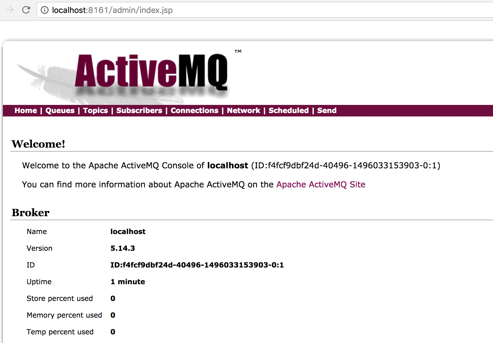
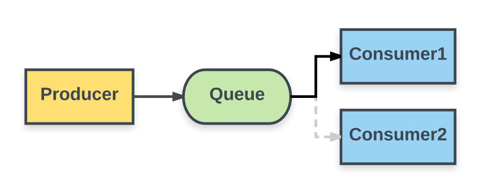

# JMS 在 SpringBoot 的使用
> 摘要：本文属于原创，欢迎转载，转载请保留出处：[https://github.com/jasonGeng88/blog](https://github.com/jasonGeng88/blog)
> 本文所有服务均采用docker容器化方式部署

## 当前环境
1. Mac OS 10.11.x
2. docker 1.12.1 
3. JDK 1.8
4. SpringBoot 1.5
 
 
## 前言
基于之前一篇[“一个故事告诉你什么是消息队列”](https://github.com/jasonGeng88/blog/blob/master/201705/MQ.md)，了解了消息队列的使用场景以及相关的特性。本文主要讲述消息服务在 JAVA 中的使用。

市面上的有关消息队列的技术选型非常多，如果我们的代码框架要支持不同的消息实现，在保证框架具有较高扩展性的前提下，我们势必要进行一定的封装。

在 JAVA 中，大可不必如此。因为 JAVA 已经制定了一套标准的 JMS 规范。该规范定义了一套通用的接口和相关语义，提供了诸如持久、验证和事务的消息服务，其最主要的目的是允许Java应用程序访问现有的消息中间件。就和 JDBC 一样。


## 基本概念
在介绍具体的使用之前，先简单介绍一下 JMS 的一些基本知识。这里我打算分为 3 部分来介绍，即 消息队列（MQ）的连接、消息发送与消息接收。

***这里我们的技术选型是 SpringBoot、JMS、ActiveMQ***

*为了更好的理解 JMS，这里没有使用 SpringBoot 零配置来搭建项目*

### MQ 的连接
使用 MQ 的第一步一定是先连接 MQ。因为这里使用的是 JMS 规范，对于任何遵守 JMS 规范的 MQ 来说，都会实现相应的```ConnectionFactory```接口，因此我们只需要创建一个```ConnectionFactory```工厂类，由它来实现 MQ 的连接，以及封装一系列特性的 MQ 参数。

例子：这里我们以 ActiveMQ 为例，

maven 依赖：

```xml
<parent>
	<groupId>org.springframework.boot</groupId>
	<artifactId>spring-boot-starter-parent</artifactId>
	<version>1.5.3.RELEASE</version>
</parent>

<dependencies>
	<dependency>
		<groupId>org.springframework.boot</groupId>
		<artifactId>spring-boot-starter-activemq</artifactId>
	</dependency>
</dependencies>
```

创建 ActiveMQ 连接工厂：

```java
@Bean
public ConnectionFactory connectionFactory(){

    ActiveMQConnectionFactory connectionFactory = new ActiveMQConnectionFactory();
    connectionFactory.setBrokerURL(ActiveMQ_URL);
    connectionFactory.setUserName(ActiveMQ_USER);
    connectionFactory.setPassword(ActiveMQ_PASSWORD);
    return connectionFactory;
    
}
```

### 消息发送
关于消息的发送，是通过 JMS 核心包中的```JmsTemplate```类来实现的，它简化了 JMS 的使用，因为在发送或同步接收消息时它帮我们处理了资源的创建和释放。从它的作用也不难推测出，它需要引用我们上面创建的连接工厂，具体代码如下：

```java
@Bean
public JmsTemplate jmsQueueTemplate(){

    return new JmsTemplate(connectionFactory());
    
}
```

```JmsTemplate```创建完成后，我们就可以调用它的方法来发送消息了。这里有两个概念需要注意：

1. 消息会发送到哪里？-> 即需要指定发送队列的目的地（Destination），是可以在 JNDI 中进行存储和提取的 JMS 管理对象。
2. 发送的消息体具体是什么？-> 实现了```javax.jms.Message```的对象，类似于 JAVA RMI 的 Remote 对象。

代码示例：

```java
@Autowired
private JmsTemplate jmsQueueTemplate;

/**
 * 发送原始消息 Message
 */
public void send(){

    jmsQueueTemplate.send("queue1", new MessageCreator() {
        @Override
        public Message createMessage(Session session) throws JMSException {
            return session.createTextMessage("我是原始消息");
        }
    });
    
}
```

优化：当然，我们不用每次都通过```MessageCreator ```匿名类的方式来创建```Message```对象，```JmsTemplate```类中提供了对象实体自动转换为```Message```对象的方法，```convertAndSend(String destinationName, final Object message)```。

优化代码示例：

```java
/**
 * 发送消息自动转换成原始消息
 */
public void convertAndSend(){

    jmsQueueTemplate.convertAndSend("queue1", "我是自动转换的消息");
    
}
```

*注：关于消息转换，还可以通过实现```MessageConverter```接口来自定义转换内容*

### 消息接收

讲完了消息发送，我们最后来说说消息是如何接收的。消息既然是以```Message```对象的形式发送到指定的目的地，那么消息的接收势必会去指定的目的地上去接收消息。这里采用的是监听者的方式来监听指定地点的消息，采用注解```@JmsListener```来设置监听方法。

代码示例：

```java
@Component
public class Listener1 {

    @JmsListener(destination = "queue1")
    public void receive(String msg){
        System.out.println("监听到的消息内容为: " + msg);
    }
    
}
```

有了监听的目标和方法后，监听器还得和 MQ 关联起来，这样才能运作起来。这里的监听器可能不止一个，如果每个都要和 MQ 建立连接，肯定不太合适。所以需要一个监听容器工厂的概念，即接口```JmsListenerContainerFactory```，它会引用上面创建好的与 MQ 的连接工厂，由它来负责接收消息以及将消息分发给指定的监听器。当然也包括事务管理、资源获取与释放和异常转换等。

代码示例：

```java
@Bean
public DefaultJmsListenerContainerFactory jmsQueueListenerContainerFactory() {
    
    DefaultJmsListenerContainerFactory factory =
            new DefaultJmsListenerContainerFactory();
    factory.setConnectionFactory(connectionFactory());
    //设置连接数
    factory.setConcurrency("3-10");
    //重连间隔时间
    factory.setRecoveryInterval(1000L);
    return factory;
    
}
```

## 场景

代码地址：[https://github.com/jasonGeng88/springboot-jms](https://github.com/jasonGeng88/springboot-jms)

对 JMS 有了基本的理解后，我们就来在具体的场景中使用一下。

首先，我们需要先启动 ActiveMQ，这里我们以 Docker 容器化的方式进行启动。

启动命令：

```
docker run -d -p 8161:8161 -p 61616:61616 --name activemq webcenter/activemq
```

启动成功后，在 ActiveMQ 可视化界面查看效果（http://localhost:8161）：



---

### 点对点模式（单消费者）

下面介绍消息队列中最常用的一种场景，即点对点模式。基本概念如下：

1. 每个消息只能被一个消费者（Consumer）进行消费。一旦消息被消费后，就不再在消息队列中存在。
2. 发送者和接收者之间在时间上没有依赖性，也就是说当发送者发送了消息之后，不管接收者有没有正在运行，它不会影响到消息被发送到队列。
3. 接收者在成功接收消息之后需向队列应答成功。


#### 代码实现（为简化代码，部分代码沿用上面所述）：

* 启动文件（Application.java）

```java
@SpringBootApplication
@EnableJms
public class Application {

    ...

    /**
     * JMS 队列的模板类
     * connectionFactory() 为 ActiveMQ 连接工厂
     */
    @Bean
    public JmsTemplate jmsQueueTemplate(){
        return new JmsTemplate(connectionFactory());
    }

    public static void main(String[] args) {
        SpringApplication.run(Application.class, args);
    }

}
```

注解```@EnableJms```设置在```@Configuration```类上，用来声明对 JMS 注解的支持。

* 消息生产者（PtpProducer.java）

```java
@Component
public class PtpProducer {

    @Autowired
    private JmsTemplate jmsQueueTemplate;

    /**
     * 发送消息自动转换成原始消息
     */
    public void convertAndSend(){
        jmsQueueTemplate.convertAndSend("ptp", "我是自动转换的消息");
    }
}
```

* 生产者调用类（PtpController.java）

```java
@RestController
@RequestMapping(value = "/ptp")
public class PtpController {

    @Autowired
    private PtpProducer ptpProducer;

    @RequestMapping(value = "/convertAndSend")
    public Object convertAndSend(){
        ptpProducer.convertAndSend();
        return "success";
    }

}
```

* 消息监听容器工厂

```java
@SpringBootApplication
@EnableJms
public class Application {

	...

    /**
     * JMS 队列的监听容器工厂
     */
    @Bean(name = "jmsQueueListenerCF")
    public DefaultJmsListenerContainerFactory jmsQueueListenerContainerFactory() {
        DefaultJmsListenerContainerFactory factory =
                new DefaultJmsListenerContainerFactory();
        factory.setConnectionFactory(connectionFactory());
        //设置连接数
        factory.setConcurrency("3-10");
        //重连间隔时间
        factory.setRecoveryInterval(1000L);
        return factory;
    }

   ...
   
}
```

* 消息监听器

```java
@Component
public class PtpListener1 {

    /**
     * 消息队列监听器
     * destination 队列地址
     * containerFactory 监听器容器工厂, 若存在2个以上的监听容器工厂,需进行指定
     */
    @JmsListener(destination = "ptp", containerFactory = "jmsQueueListenerCF")
    public void receive(String msg){
    
        System.out.println("点对点模式1: " + msg);
        
    }
}
```

#### 演示

启动项目启动后，通过 REST 接口的方式来调用消息生产者发送消息，请求如下：

```
curl -XGET 127.0.0.1:8080/ptp/convertAndSend
```

消费者控制台信息：


ActiveMQ 控制台信息：


列表说明：

* Name：队列名称。
* Number Of Pending Messages：等待消费的消息个数。
* Number Of Consumers：当前连接的消费者数目，因为我们采用的是连接池的方式连接，初始连接数为 3，所以显示数字为 3。
* Messages Enqueued：进入队列的消息总个数，包括出队列的和待消费的，这个数量只增不减。
* Messages Dequeued：出了队列的消息，可以理解为是已经消费的消息数量。


### 点对点模式（多消费者）

基于上面一个消费者消费的模式，因为生产者可能会有很多，同时像某个队列发送消息，这时一个消费者可能会成为瓶颈。所以需要多个消费者来分摊消费压力（*消费线程池能解决一定压力，但毕竟在单机上，做不到分布式分布，所以多消费者是有必要的*），也就产生了下面的场景。



#### 代码实现

* 添加新的监听器

```java
@Component
public class PtpListener2 {

    @JmsListener(destination = Constant.QUEUE_NAME, containerFactory = "jmsQueueListenerCF")
    public void receive(String msg){
    
        System.out.println("点对点模式2: " + msg);
        
    }
}
```

#### 演示

这里我们发起 10 次请求，来观察消费者的消费情况：


*这里因为监听容器设置了线程池的缘故，在实际消费过程中，监听器消费的顺序会有所差异。*


### 发布订阅模式

除了点对点模式，发布订阅模式也是消息队列中常见的一种使用。试想一下，有一个即时聊天群，你在群里发送一条消息。所有在这个群里的人（即订阅了该群的人），都会收到你发送的信息。

基本概念：

1. 每个消息可以有多个消费者。
2. 发布者和订阅者之间有时间上的依赖性。针对某个主题（Topic）的订阅者，它必须创建一个订阅者之后，才能消费发布者的消息。
3. 为了消费消息，订阅者必须保持运行的状态。


#### 代码实现

* 修改 JmsTemplate 模板类，使其支持发布订阅功能

```java
@SpringBootApplication
@EnableJms
public class Application {

    ...

    @Bean
    public JmsTemplate jmsTopicTemplate(){
        JmsTemplate jmsTemplate = new JmsTemplate(connectionFactory());
        jmsTemplate.setPubSubDomain(true);
        return jmsTemplate;
    }
    
    ...

}
```

* 消息生产者（PubSubProducer.java）

```java
@Component
public class PtpProducer {

    @Autowired
    private JmsTemplate jmsTopicTemplate;

    public void convertAndSend(){
		jmsTopicTemplate.convertAndSend("topic", "我是自动转换的消息");
    }
}
```

* 生产者调用类（PubSubController.java）

```java
@RestController
@RequestMapping(value = "/pubsub")
public class PtpController {

    @Autowired
    private PubSubProducer pubSubProducer;

    @RequestMapping(value = "/convertAndSend")
    public String convertAndSend(){
        pubSubProducer.convertAndSend();
        return "success";
    }

}
```

* 修改 DefaultJmsListenerContainerFactory 类，使其支持发布订阅功能

```java
@SpringBootApplication
@EnableJms
public class Application {

	...

    /**
     * JMS 队列的监听容器工厂
     */
    @Bean(name = "jmsTopicListenerCF")
    public DefaultJmsListenerContainerFactory jmsTopicListenerContainerFactory() {
        DefaultJmsListenerContainerFactory factory =
                new DefaultJmsListenerContainerFactory();
        factory.setConnectionFactory(connectionFactory());
        factory.setConcurrency("1");
        factory.setPubSubDomain(true);
        return factory;
    }

   ...
   
}
```

* 消息监听器（这里设置2个订阅者）

```java
@Component
public class PubSubListener1 {

    @JmsListener(destination = "topic", containerFactory = "jmsTopicListenerCF")
    public void receive(String msg){
        System.out.println("订阅者1 - " + msg);
    }
}

@Component
public class PubSubListener2 {

    @JmsListener(destination = "topic", containerFactory = "jmsTopicListenerCF")
    public void receive(String msg){
        System.out.println("订阅者2 - " + msg);
    }
}
```

#### 演示

```
curl -XGET 127.0.0.1:8080/pubSub/convertAndSend
```

消费者控制台信息：


ActiveMQ 控制台信息：


## 总结

这里只是对 SpringBoot 与 JMS 集成的简单说明与使用，详细的介绍可以查看 Spring 的官方文档，我这里也有幸参与 并发编程网 发起的 Spring 5 的翻译工作，我主要翻译了 [Spring 5 的 JMS 章节](http://ifeve.com/spring-5-26-jms-java-message-service/)，其内容对于上述 JMS 的基本概念，都有详细的展开说明，有兴趣的可以看一下，当然翻译水平有限，英文好的建议看原文。