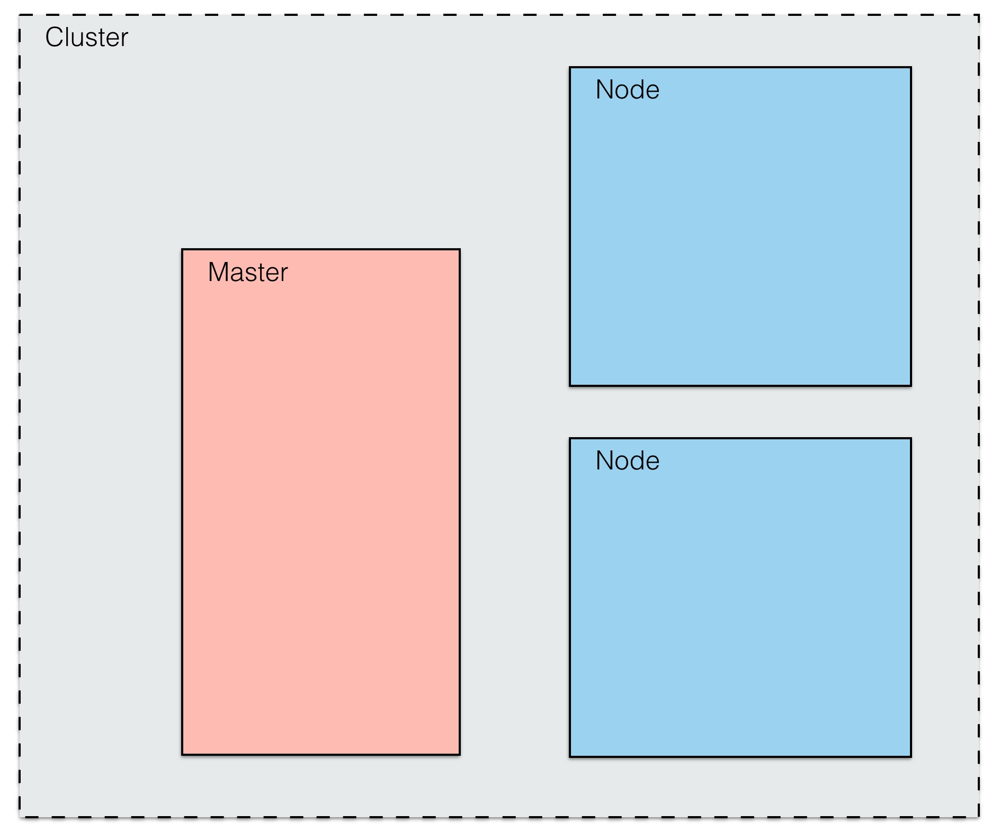
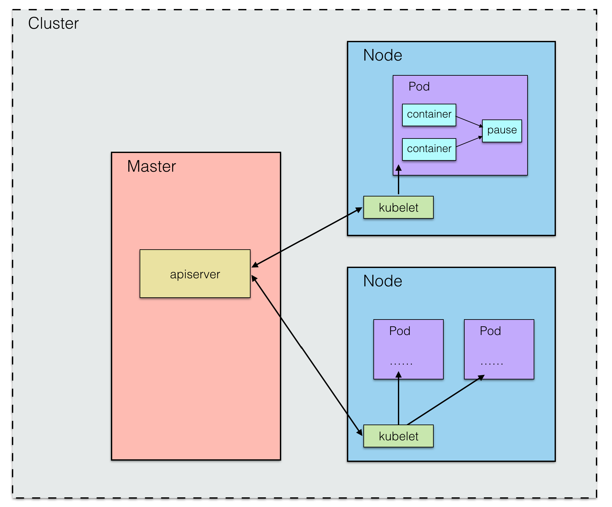
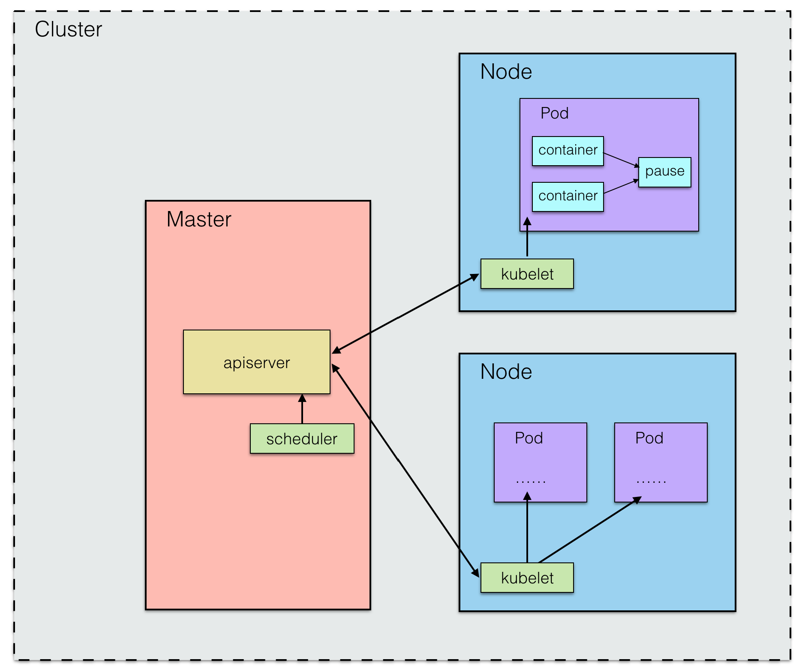
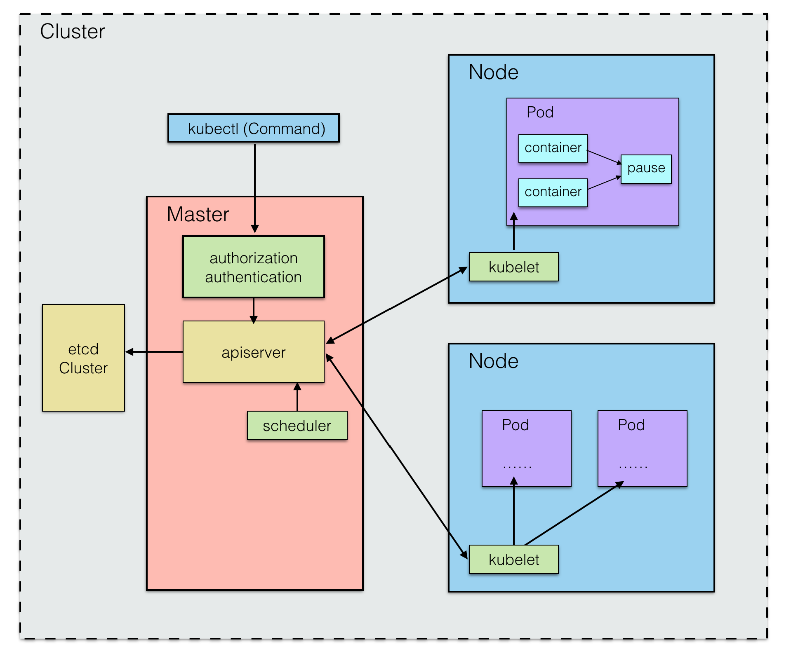
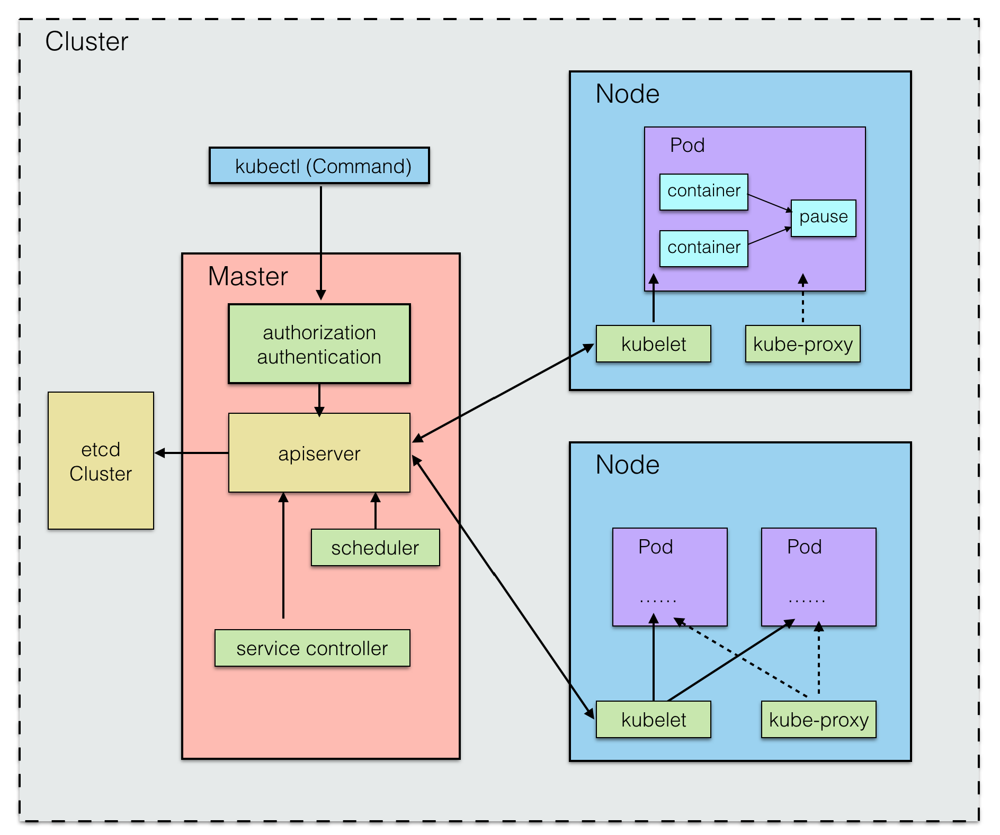
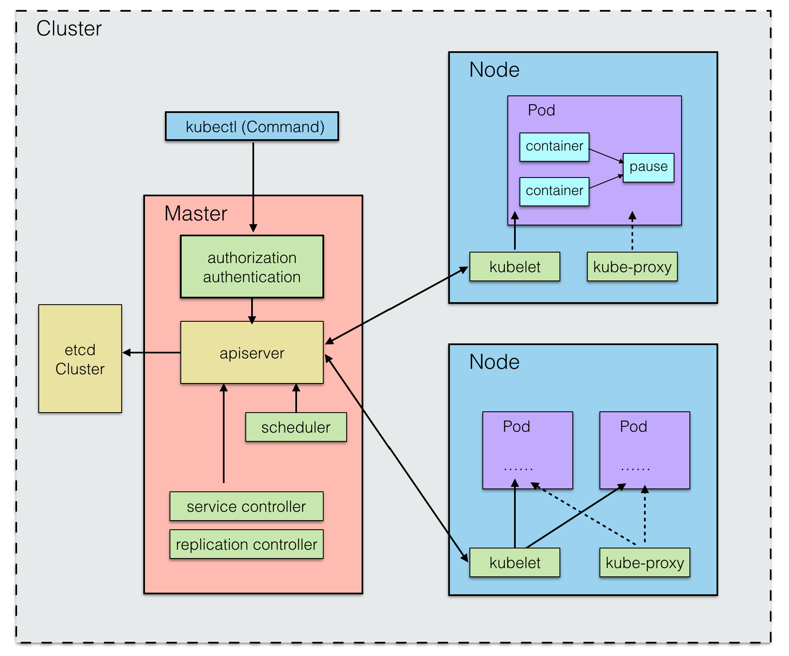

# 带着问题学 Kubernetes 架构图
> 摘要：本文属于原创，欢迎转载，转载请保留出处：[https://github.com/jasonGeng88/blog](https://github.com/jasonGeng88/blog)
 
打开这篇文章的同学，想必对 docker 都不会陌生。docker 是一种虚拟容器技术，它上手比较简单，只需在宿主机上起一个 docker engine，然后就能愉快的玩耍了，如：拉镜像、起容器、挂载数据、映射端口等等。相对于 Kubernetes（K8S）的上手，可谓简单很多。

那么 K8S 是什么，又为什么上手难度大？K8S 是一个基于容器技术的分布式集群管理系统，是谷歌几十年来大规模应用容器技术的经验积累和升华的一个重要成果。所以为了能够支持大规模的集群管理，它承载了很多的组件，而且分布式本身的复杂度就很高。又因为 K8S 是谷歌出品的，依赖了很多谷歌自己的镜像，所以对于国内的同学环境搭建的难度又增加了一层。

下面，我们带着问题，一步步来看 K8S 中到底有哪些东西？

首先，既然是个分布式系统，那势必有多个 Node 节点（物理主机或虚拟机），它们共同组成一个分布式集群，并且这些节点中会有一个 Master 节点，由它来统一管理 Node 节点。

如图所示：

### 问题一：主节点和工作节点是如何通信的呢？

首先，Master 节点启动时，会运行一个 [kube-apiserver](https://kubernetes.io/docs/admin/kube-apiserver/) 进程，它提供了集群管理的 API 接口，是集群内各个功能模块之间数据交互和通信的中心枢纽，并且它页提供了完备的集群安全机制（*后面还会讲到*）。

在 Node 节点上，使用 K8S 中的 [kubelet](https://kubernetes.io/docs/admin/kubelet/) 组件，在每个 Node 节点上都会运行一个 kubelet 进程，它负责向 Master 汇报自身节点的运行情况，如 Node 节点的注册、终止、定时上报健康状况等，以及接收 Master 发出的命令，创建相应 [Pod](https://kubernetes.io/docs/concepts/workloads/pods/pod/)。

在 K8S 中，Pod 是最基本的操作单元，它与 docker 的容器有略微的不同，因为 Pod 可能包含一个或多个容器（可以是 docker 容器），这些内部的容器是共享网络资源的，即可以通过 localhost 进行相互访问。

关于 Pod 内是如何做到网络共享的，每个 Pod 启动，内部都会启动一个 pause 容器（google的一个镜像），它使用默认的网络模式，而其他容器的网络都设置给它，以此来完成网络的共享问题。

如图所示：

### 问题二：Master 是如何将 Pod 调度到指定的 Node 上的？

该工作由 [kube-scheduler](https://kubernetes.io/docs/admin/kube-scheduler/) 来完成，整个调度过程通过执行一些列复杂的算法最终为每个 Pod 计算出一个最佳的目标 Node，该过程由 kube-scheduler 进程自动完成。常见的有轮询调度（RR）。当然也有可能，我们需要将 Pod 调度到一个指定的 Node 上，我们可以通过节点的标签（Label）和 Pod 的 nodeSelector 属性的相互匹配，来达到指定的效果。

如图所示：

***关于标签（Label）与选择器（Selector）的概念，后面会进一步介绍***

### 问题三：各节点、Pod 的信息都是统一维护在哪里的，由谁来维护？

从上面的 Pod 调度的角度看，我们得有一个存储中心，用来存储各节点资源使用情况、健康状态、以及各 Pod 的基本信息等，这样 Pod 的调度来能正常进行。

在 K8S 中，采用 [etcd 组件](https://github.com/coreos/etcd) 作为一个高可用强一致性的存储仓库，该组件可以内置在 K8S 中，也可以外部搭建供 K8S 使用。

集群上的所有配置信息都存储在了 etcd，为了考虑各个组件的相对独立，以及整体的维护性，对于这些存储数据的增、删、改、查，统一由 kube-apiserver 来进行调用，apiserver 也提供了 REST 的支持，不仅对各个内部组件提供服务外，还对集群外部用户暴露服务。

外部用户可以通过 REST 接口，或者 kubectl 命令行工具进行集群管理，其内在都是与 apiserver 进行通信。

如图所示：

### 问题四：外部用户如何访问集群内运行的 Pod ？

前面讲了外部用户如何管理 K8S，而我们更关心的是内部运行的 Pod 如何对外访问。使用过 docker 的同学应该知道，如果使用 bridge 模式，在容器创建时，都会分配一个虚拟 IP，该 IP 外部是没法访问到的，我们需要做一层端口映射，将容器内端口与宿主机端口进行映射绑定，这样外部通过访问宿主机的指定端口，就可以访问到内部容器端口了。

那么，K8S 的外部访问是否也是这样实现的？答案是否定的，K8S 中情况要复杂一些。因为上面讲的 docker 是单机模式下的，而且一个容器对外就暴露一个服务。在分布式集群下，一个服务往往由多个 Application 提供，用来分担访问压力，而且这些 Application 可能会分布在多个节点上，这样又涉及到了跨主机的通信。

这里，K8S 引入了 service 的概念，将多个相同的 Pod 包装成一个完整的 service 对外提供服务，至于获取到这些相同的 Pod，每个 Pod 启动时都会设置 labels 属性，在 service 中我们通过选择器 selector，选择具有相同 name 标签属性的 Pod，作为整体服务，并将服务信息通过 apiserver 存入 etcd 中，该工作由 Service Controller 来完成。同时，每个节点上会启动一个 [kube-proxy](https://kubernetes.io/docs/admin/kube-proxy/) 进程，由它来负责服务地址到 Pod 地址的代理以及负载均衡等工作。

如图所示：

### 问题五：Pod 如何动态扩容和缩放？

既然知道了服务是由 Pod 组成的，那么服务的扩容也就意味着 Pod 的扩容。通俗点讲，就是在需要时将 Pod 复制多份，在不需要后，将 Pod 缩减至指定份数。K8S 中通过 Replication Controller 来进行管理，为每个 Pod 设置一个期望的副本数，当实际副本数与期望不符时，就动态的进行数量调整，以达到期望值。期望数值可以由我们手动更新，或自动扩容代理来完成。

如图所示：

### 问题六：各个组件之间是如何相互协作的？

最后，讲一下 kube-controller-manager 这个进程的作用。我们知道了 ectd 是作为集群数据的存储中心， apiserver 是管理数据中心，作为其他进程与数据中心通信的桥梁。而 Service Controller、Replication Controller 这些统一交由 kube-controller-manager 来管理，kube-controller-manager 作为一个守护进程，每个 Controller 都是一个控制循环，通过 apiserver 监视集群的共享状态，并尝试将实际状态与期望不符的进行改变。关于 Controller，manager 中还包含了 Node 节点控制器（Node Controller）、资源配额管控制器（ResourceQuota Controller）、命名空间控制器（Namespace Controller）等。

如图所示：

## 总结

本文通过问答的方式，没有涉及任何深入的实现细节，从整体的角度，概念性的介绍了 K8S 中涉及的基本概念，其中使用相关的包括有：

* Node
* Pod
* Label
* Selector
* Replication Controller
* Service Controller
* ResourceQuota Controller
* Namespace Controller
* Node Controller

以及运行进程相关的有：

* kube-apiserver
* kube-controller-manager
* kube-scheduler
* kubelet
* kube-proxy
* pause

这也是我学习 K8S 后对其整体架构的一次总结，因为在刚上手时，阅读官方文档，确实被如此多的内容搞得有点晕，所在在这里进行了简单的梳理。文中有理解不到位的地方，欢迎指正！

