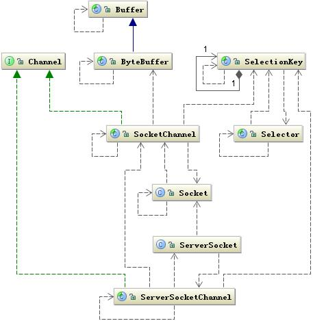

# JAVA NIO 下的 IO 多路复用
> 摘要：本文属于原创，欢迎转载，转载请保留出处：[https://github.com/jasonGeng88/blog](https://github.com/jasonGeng88/blog)

* 文章一：[JAVA 中原生的 socket 通信机制](https://github.com/jasonGeng88/blog/blob/master/201708/java-socket.md)

## 当前环境
1. jdk == 1.8

## 知识点
* NIO 下的阻塞实现
* IO 多路复用的原理
* 缓冲区的数据处理方式
* socket 的连接通道
* NIO 下的事件选择器
* 事件监听类型

## 场景

接着上一篇中的站点访问问题，如果我们需要并发访问10个不同的网站，我们该如何处理？

在上一篇中，我们使用了```java.net.socket```类来实现了这样的需求，以一线程处理一连接的方式，并配以线程池的控制，貌似得到了当前的最优解。可是这里也存在一个问题，连接处理是同步的，也就是并发数量增大后，大量请求会在队列中等待，或直接异常抛出。

为解决这问题，我们发现元凶处在“一线程一请求”上，如果一个线程能同时处理多个请求，那么在高并发下性能上会大大改善。这里就借住 JAVA 中的 nio 技术来实现这一模型。

## nio 的阻塞实现
关于什么是 nio，从字面上理解为 New IO，就是为了弥补原本 IO 上的不足，而在 JDK 1.4 中引入的一种新的 IO 实现方式。简单理解，就是它提供了 IO 的阻塞与非阻塞的两种实现方式（*当然，默认实现方式是阻塞的。*）。

下面，我们先来看下 nio 以阻塞方式是如何处理的。

### 建立连接
有了上一篇 socket 的经验，我们的第一步一定也是建立 socket 连接。只不过，这里不是采用 ```new socket()``` 的方式，而是引入了一个新的概念 ```SocketChannel```。它可以看作是 socket 的一个完善类，除了提供 Socket 的相关功能外，还提供了许多其他特性，如后面要讲到的向选择器注册的功能。

类图如下：


建立连接代码实现：

```java
// 初始化 socket，建立 socket 与 channel 的绑定关系
SocketChannel socketChannel = SocketChannel.open();
// 初始化远程连接地址
SocketAddress remote = new InetSocketAddress(this.host, port);
// IO 处理设置阻塞，这也是默认的方式，可不设置
socketChannel.configureBlocking(true);
// 建立连接
socketChannel.connect(remote);
```

### 获取 socket 连接
因为是同样是 IO 阻塞的实现，所以后面的关于 socket 输入输出流的处理，和上一篇的基本相同。唯一差别是，这里需要通过 channel 来获取 socket 连接。

* 获取 socket 连接
 
```java
Socket socket = socketChannel.socket();
```

* 处理输入输出流

```java
PrintWriter pw = getWriter(socketChannel.socket());
BufferedReader br = getReader(socketChannel.socket());
```

### 完整示例

```java
package com.jason.network.mode.nio;

import com.jason.network.constant.HttpConstant;
import com.jason.network.util.HttpUtil;

import java.io.*;
import java.net.InetSocketAddress;
import java.net.Socket;
import java.net.SocketAddress;
import java.nio.channels.SocketChannel;

public class NioBlockingHttpClient {

    private SocketChannel socketChannel;
    private String host;


    public static void main(String[] args) throws IOException {

        for (String host: HttpConstant.HOSTS) {

            NioBlockingHttpClient client = new NioBlockingHttpClient(host, HttpConstant.PORT);
            client.request();

        }

    }

    public NioBlockingHttpClient(String host, int port) throws IOException {
        this.host = host;
        socketChannel = SocketChannel.open();
        socketChannel.socket().setSoTimeout(5000);
        SocketAddress remote = new InetSocketAddress(this.host, port);
        this.socketChannel.connect(remote);
    }

    public void request() throws IOException {
        PrintWriter pw = getWriter(socketChannel.socket());
        BufferedReader br = getReader(socketChannel.socket());

        pw.write(HttpUtil.compositeRequest(host));
        pw.flush();
        String msg;
        while ((msg = br.readLine()) != null){
            System.out.println(msg);
        }
    }

    private PrintWriter getWriter(Socket socket) throws IOException {
        OutputStream out = socket.getOutputStream();
        return new PrintWriter(out);
    }

    private BufferedReader getReader(Socket socket) throws IOException {
        InputStream in = socket.getInputStream();
        return new BufferedReader(new InputStreamReader(in));
    }
}
```

## nio 的非阻塞实现
nio 的阻塞实现，基本与使用原生的 socket 类似，没有什么特别大的差别。

是的，因为我们使用 nio，一般会使用它的非阻塞模式。通过上面的例子，我们至少知道了 ```SocketChannel``` 的概念，通过它替换了原先直接使用 socket 的操作，同时也借由它，实现了一个线程能同时处理多个 socket 连接的可能，也就是我们所说的“IO 多路复用”。

我们可以想象一下，限制一个线程同时处理多个 socket 的一个原因是，对 socket 的调用都是线程阻塞的，也就是说在对 socket 的连接、读取、写入过程，都会发生相应的阻塞等待。换句话说，对一个也就是说，如果我们在对一个 socket 进行读操作，线程是无法处理其他事情的。要实现“IO 多路复用”，第一个需要做的是将阻塞等待变为非阻塞等待，


